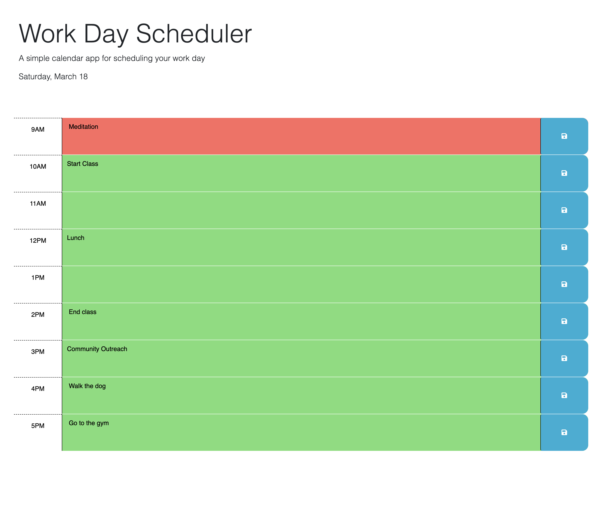

# Day Scheduler

https://autohome.github.io/dayScheduler/

## Description

This project was made to showcase javascript, local storage, and server side API skills. In this project, the user can enter in their schedule for the day. There are text areas for each time block, and when the save button is clicked, siad text will be saved to local storage. Upon refresh, text will reappear in correct time block. 

Through dayjs API, the current day will be displayed at the top of the page. Also through dayjs, the color of the time blocks will change as the day the progresses. All future hours will be green, present will be red, and past will be grey.

UCLA bootcamp provided started code for this project which included the base HTML and CSS.

## Installation

N/A

## Usage

The website address is [autohome.github.io/dayScheduler](https://autohome.github.io/dayScheduler/)

To use the site, please enter a task in the text area of the time block and click save button on the far right of the same box.

## Credits

Starter code provided was [coding-boot-camp by crispy-octo-meme](https://github.com/coding-boot-camp/crispy-octo-meme)

Speciathanks to Shawn Tschoepe (UCLA bootcamp TA) for help implementing the .each throughout the JS code.

Many thanks to UCLA bootcamp students and staff.

## License

MIT License
